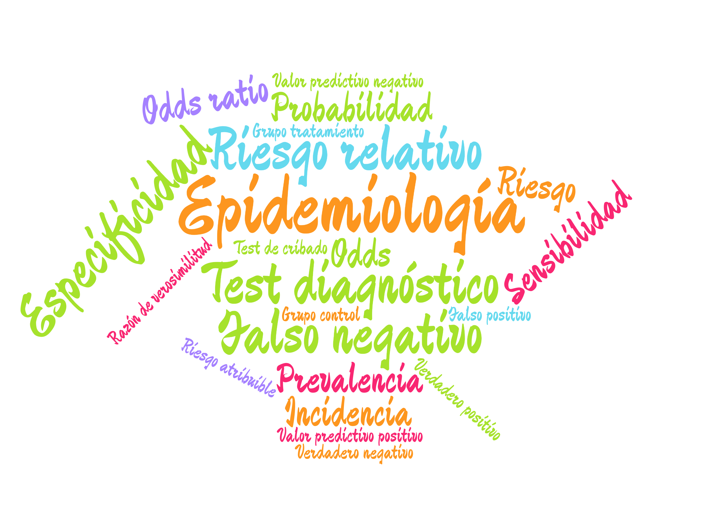
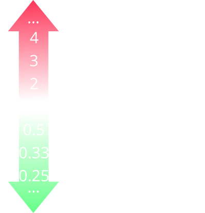
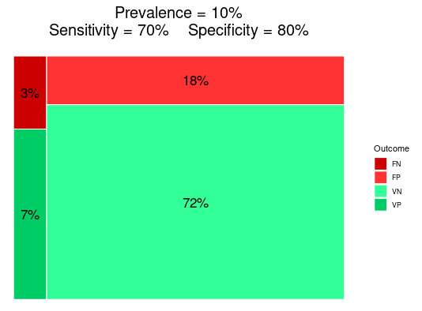
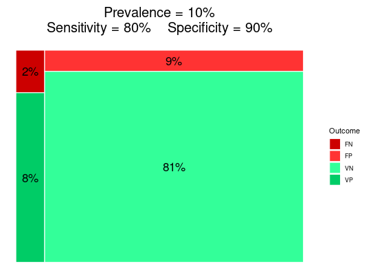
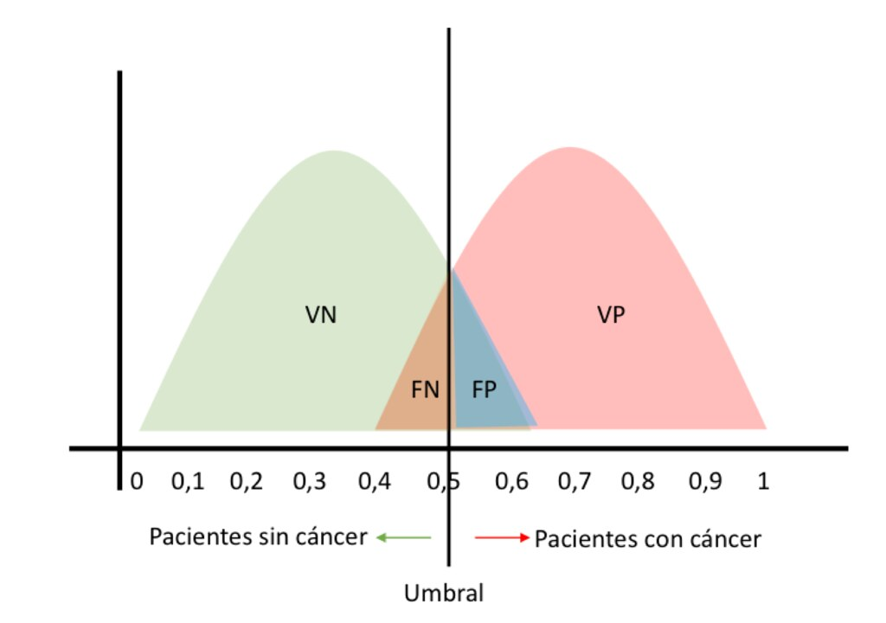
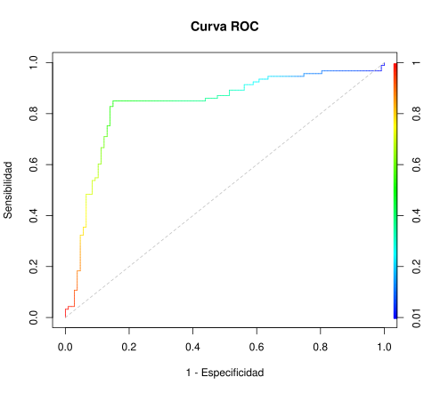

<!-- .slide: data-background="./img/virus.jpeg" -->

    

**Seminario Ciencia y Humanismo** 

Epidemiología para tiempos de pandemias

Alfredo Sánchez Alberca <a href="mailto:asalber@ceu.es"><i class='fa fa-envelope'></i></a> <a href="https://twitter.com/aprendeconalf"><i class='fa fa-twitter'></i></a> <a href="https://aprendeconalf.es"><i class='fa fa-home'></i></a>

15 marzo 2022

---

## ¿Qué es la Epidemiología?

Epidemiología viene Griego: Epi (sobre), demos (gente) y logos (estudio), es decir, el estudio de lo que le ocurre a las poblaciones.

> En el ámbito de la salud pública, la **Epidemilogía** es una rama de la Medicina que se encarga del estudio de la distribución y las causas de eventos relacionados con la salud (normalmente enfermedades) en las poblaciones, y la aplicación de este estudio para controlar problemas públicos de salud.

--

## La Epidemiología está de moda

--

## Algunos descubrimientos históricos

- 1854: John Snow determina que la causa de la epidemia de cólera que asolaba Lóndres era que el agua estaba contaminada con heces.
- 1898: Ronald Ross averigua que el transmisor de la malaria es el el mosquito Anopheles.
- 1950: Se descubre que fumar es el principal factor de riesgo de cáncer de pulmón.
- 1954: Se valida la primera vacuna contra la poliomielitis (Jonas Salk’s).
- 1970: Se observó que el ejercicio físico y una dieta sana reducían el riesgo de sufrir un infarto.
- 1983: Robert Gallo, Luc Montagnier y Françoise Barré-Sinoussi identifican el virus que causa el SIDA. Poco después se se observó que el riesgo de contraer el HIV aumentaba con ciertas prácticas sexuales y con el consumo de algunos tipos de drogas.

--

--

## Índices epidemiológicos basados en probabilidades

<h3>Riesgos</h3>

- Prevalencia
- Incidencia
- Riesgo y Odds
- Riesgo/Odd relativo

<h3>Test diagnósticos</h3>

- Sensibilidad
- Especificidad
- Valores predictivos
- Curva ROC

---

## El concepto de probabilidad

> **Definición clásica (Laplace)** $$P(E)=\frac{|E|}{|\Omega|}=\frac{\mbox{Casos favorables a $E$}}{\mbox{Casos posibles}}$$

**Ejemplo** Al tirar un dado equilibrado, la probabilidad de sacar un número par $E=\\{2, 4, 6\\}$ es
$$ P(E) = \frac{3}{6} = 0.5$$ <!-- .element: class="fragment" -->

--

## El concepto de probabilidad

> **Definición frecuentista** $$P(E)\approx f_E = \frac{n_E}{n}=\frac{\mbox{Frecuencia absoluta del evento}}{\mbox{Tamaño muestral}}$$

**Ejemplo** Se ha aplicado un tratamiento a 100 personas y se han curado 75, entonces la probabilidad de curación del tratamiento es
$$P(E) = \frac{75}{100} = 0.75 \Rightarrow 75\\%$$ <!-- .element: class="fragment" -->

--

## Algunas propiedades de la probabilidad

$$0\leq P(E)\leq 1$$  <!-- .element: class="fragment" -->

$$P(\Omega) = P(e_1) + P(e_2) + \cdots + P(e_n) = 1$$ <!-- .element: class="fragment" -->

$$P(\overline E) = 1 - P(E)$$ <!-- .element: class="fragment" -->

--

## Interpretación de una probabilidad

La probabilidad mide la verosimilitud de un suceso.

De manera informal, se puede decir que la probabilidad mide la creencia o la confianza que tenemos en la ocurrencia de un suceso.

- $P(E) = 0 \Rightarrow$ Mínima verosimilitud
- $P(E) = 0.5 \Rightarrow$ Verosimilitud media (máxima incertidumbre)
- $P(E) = 1 \Rightarrow$ Máxima verosimilitud

--

## El concepto de Odds

> $$O(E)=\frac{\mbox{Nº casos con $E$}}{\mbox{Nº casos sin $E$}}=\frac{P(E)}{P(\overline E)}$$

**Ejemplo** Se ha aplicado un tratamiento a 100 personas y se han curado 75, entonces el odds de curación del tratamiento es $$O(E) = \frac{75}{25} = 3$$ <!-- .element: class="fragment" -->

<i class="fa fa-exclamation-triangle" style="color:#ff9900;"></i> Un odds puede ser mayor que 1. <!-- .element: class="fragment" -->

--

## Interpretación de un Odds

Los odds también permiten cuantificar la verosimilitud de un suceso..., pero en una escala diferente, ya que es una razón de probabilidades.

- $O(E) = 0 \Rightarrow$ Mínima verosimilitud
- $O(E) = 1 \Rightarrow$ Verosimilitud media (máxima incertidumbre)
- $O(E) = \infty \Rightarrow$ Máxima verosimilitud

--

## Conversión de Odds en probabilidades

$$ \frac{O(E)}{1 + O(E)} = \frac{\frac{P(E)}{P(\overline E)}}{1 + \frac{P(E)}{P(\overline E)}} = \frac{\frac{P(E)}{P(\overline E)}}{\frac{P(\overline E) + P(E)}{P(\overline E)}} = P(E)$$

**Ejemplo** Se ha aplicado un tratamiento a 100 personas y se han curado 75.
$$O(E) = \frac{75}{25} = 3 \Rightarrow P(E) = \frac{3}{1+3}=0.75$$ <!-- .element: class="fragment" -->

---

## Prevalencia

> La _prevalencia_ de una enfermedad $E$ es la proporción de personas que tienen la enfermedad en un momento concreto.
> $$\mbox{Prevalencia}(E) = \frac{\mbox{Nº individuos afectados por $E$}}{\mbox{Tamaño poblacional}}$$

**Ejemplo**. En una muestra de 1000 personas 150 tenían gripe. La prevalencia de la gripe es aproximadamente $$\frac{150}{1000}=0.15$$ <!-- .element: class="fragment" -->

--

## Incidencia o riesgo absoluto

> La _incidencia_ o _riesgo absoluto_ de una enfermedad $E$ es la proporción de nuevos casos durante un periodo determinado (por día, por semana, por mes, etc.)
> $$R(E)=\frac{\mbox{Nº nuevos casos con $E$ en el periodo}}{\mbox{Tamaño población en riesgo al comienzo del periodo}}$$

**Ejemplo**. Al comienzo del año se tomó una muestra de 1000 personas sin gripe y al finalizar el año 80 tuvieron gripe. La incidencia de la gripe ese año fue
$$ R(E) = \frac{80}{1000} = 0.08$$ <!-- .element: class="fragment" -->

--

## Prevalencia vs Incidencia

|             | Tiempo  |        Casos        | Tipo estudio |
| ----------- | :-----: | :-----------------: | :----------: |
| Prevalencia | Puntual | Nuevos y existentes | Transversal  |
| Incidencia  | Periodo |     Solo nuevos     | Longitudinal |

- La prevalencia muestra el número de personas afectadas (carga de la enfermedad).
- La incidencia muestra la evolución de la enfermedad y es más útil para detectar brotes y estudiar su causa.
- La incidencia depende sobre todo de la contagiosidad de la enfermedad, mientras que la prevalencia depende también de la duración de la enfermedad y de lo agresiva que sea.

<!-- $$ P(E) < R(E) $$ -->

--

## Algunas consideraciones en el caso el COVID

[Datos del ministerio de sanidad](https://www.mscbs.gob.es/profesionales/saludPublica/ccayes/alertasActual/nCov/situacionActual.htm)

La incidencia del COVID se suele dar sobre un periodo de dos semanas (14 días) aunque no siempre.

Los datos son poco precisos y subestiman el riesgo del COVID:

- Muchos asintomáticos no son detectados.
- En muchos casos la detección de la enfermedad es mediante test diagnósticos que tienen un margen de error (falsos positivos y falsos negativos).
- Se calcula dividiendo por el tamaño de la población (nuevos casos por cada 100000 habitantes) pero habría que dividir por el tamaño de la población en riesgo (sin contar ya infectados o inmunizados).

---

## Comparación de riesgos

Dos grupos:

- Grupo tratamiento $T$: Individuos expuestos a un factor.
- Grupo control $C$: Individuos no expuestos al factor.

 
 

<table class="colortable">
<thead>
<tr class="header">
<th style="text-align: left;"></th>
<th style="text-align: left;">$E$</th>
<th style="text-align: left;">$\overline E$</th>
</tr>
</thead>
<tbody>
<td style="text-align: left;">$T$</td>
<td style="text-align: center;">$a$</td>
<td style="text-align: center;">$b$</td>
</tr>
<td style="text-align: left;">$C$</td>
<td style="text-align: center;">$c$</td>
<td style="text-align: center;">$d$</td>
</tr>
<td></td>
</tbody>
</table>

--

## Riesgo relativo

> $$RR(E)=\frac{\mbox{Riesgo grupo tratamiento}}{\mbox{Riesgo grupo control}}=\frac{R_T(E)}{R_C(E)}=\frac{a/(a+b)}{c/(c+d)}$$

**Ejemplo** 
<table>
<thead>
<tr class="header">
<th style="text-align: left;"></th>
<th style="text-align: center;">Gripe $G$</th>
<th style="text-align: center;">No gripe $\overline G$</th>
</tr>
</thead>
<tbody>
<tr class="odd">
<td style="text-align: left;">Vacunados $T$</td>
<td style="text-align: center;">20</td>
<td style="text-align: center;">480</td>
</tr>
<tr class="even">
<td style="text-align: left;">No vacunados $C$</td>
<td style="text-align: center;">80</td>
<td style="text-align: center;">420</td>
</tr>
<td></td>
</tbody>
</table> 

$$RR(G) = \frac{20/(20+480)}{80/(80+420)} = 0.25$$

--

## Interpretación del riesgo relativo

- $RR=1$ $\Rightarrow$ No hay asociación entre el suceso y la exposición al factor.
- $RR<1$ $\Rightarrow$ La exposición al factor disminuye el riesgo del suceso.
- $RR>1$ $\Rightarrow$ La exposición al factor aumenta el riesgo del suceso.

--

## Odds ratio

> $$OR(E)=\frac{\mbox{Odds grupo tratamiento}}{\mbox{Odds grupo control}}=\frac{O_T(E)}{O_C(E)}=\frac{a/b}{c/d}=\frac{ad}{bc}$$

**Ejemplo** 
<table>
<thead>
<tr class="header">
<th style="text-align: left;"></th>
<th style="text-align: center;">Gripe $G$</th>
<th style="text-align: center;">No gripe $\overline G$</th>
</tr>
</thead>
<tbody>
<tr class="odd">
<td style="text-align: left;">Vacunados $T$</td>
<td style="text-align: center;">20</td>
<td style="text-align: center;">480</td>
</tr>
<tr class="even">
<td style="text-align: left;">No vacunados $C$</td>
<td style="text-align: center;">80</td>
<td style="text-align: center;">420</td>
</tr>
<td></td>
</tbody>
</table>

$$OR(G) = \frac{20/480}{80/420} = 0.22$$

--

## Interpretación del odds ratio

- $OR=1$ $\Rightarrow$ No existe asociación entre el suceso y la exposición al factor.
- $OR<1$ $\Rightarrow$ La exposición al factor disminuye el riesgo del suceso.
- $OR>1$ $\Rightarrow$ La exposición al factor aumenta el riesgo del suceso.

--

## Riesgo relativo vs Odds ratio

<i class="fa fa-exclamation-triangle" style="color:#ff9900;"></i> El riesgo relativo es una comparación de probabilidades pero depende de la incidencia de la enfermedad.

La interpretación del odds ratio es más enrevesada porque es contrafactual, ya que da cuántas veces es más frecuente el suceso en el grupo tratamiento en comparación con el control, asumiendo que en el
grupo control es tan frecuente que ocurra el suceso como que no. 

El odds ratio, sin embargo, no depende de la incidencia, por lo que es más apropiado para estudios donde no se conoce la incidencia (por ejemplo _estudios retrospectivos_).

--

## Riesgo relativo vs Odds ratio

<b>Muestra 1</b>
 
<table>
<thead>
<tr class="header">
<th style="text-align: left;"></th>
<th style="text-align: center;">Cáncer</th>
<th style="text-align: center;">No cáncer</th>
</tr>
</thead>
<tbody>
<tr class="odd">
<td style="text-align: left;">Fumadores</td>
<td style="text-align: center;">60</td>
<td style="text-align: center;">80</td>
</tr>
<tr class="even">
<td style="text-align: left;">No fumadores</td>
<td style="text-align: center;">40</td>
<td style="text-align: center;">320</td>
</tr>
<td></td>
</tbody>
</table>

$$
\begin{aligned}
P(E) &= \frac{60+40}{60+40+80+320} = 0.2\newline
RR(E) &= \frac{60/(60+80)}{40/(40+320)} = 3.86
\newline
OR(E) &= \frac{60/80}{40/320} = 6
\end{aligned}
$$

<b>Muestra 2</b>
 
<table>
<thead>
<tr class="header">
<th style="text-align: left;"></th>
<th style="text-align: center;">Cáncer</th>
<th style="text-align: center;">No cáncer</th>
</tr>
</thead>
<tbody>
<tr class="odd">
<td style="text-align: left;">Fumadores</td>
<td style="text-align: center;">60</td>
<td style="text-align: center;">160</td>
</tr>
<tr class="even">
<td style="text-align: left;">No fumadores</td>
<td style="text-align: center;">40</td>
<td style="text-align: center;">640</td>
</tr>
<td></td>
</tbody>
</table>

$$
\begin{aligned}
P(E) &= \frac{60+40}{60+40+160+640} = 0.11\newline
RR(E) &= \frac{60/(60+160)}{40/(40+640)} = 4.64
\newline
OR(E) &= \frac{60/160}{40/640} = 6 
\end{aligned}
$$

--

## Aplicación a la COVID

- [La edad aumenta la gravedad](https://www.npr.org/sections/coronavirus-live-updates/2020/03/22/819846180/study-calculates-just-how-much-age-medical-conditions-raise-odds-of-severe-covid?t=1614095513052)
- [El riesgo de infección depende del grupo sanguíneo](https://www.aarp.org/espanol/salud/enfermedades-y-tratamientos/info-2020/tipo-de-sangre-y-riesgo-de-covid.html)
- [El déficit de vitamina D aumenta el riesgo de infección](https://medicalxpress.com/news/2021-01-vitamin-d-deficiency-covid-.html)
- [Las personas con demencia tienen mayor riesgo de infectase](https://www.sciencedaily.com/releases/2021/02/210209083524.htm)
- [El Remdesivir acelera la recuperación](https://www.nejm.org/doi/full/10.1056/NEJMoa2007764)

---

## Tests diagnósticos

> Un test diagnóstico es un test usado para diagnosticar una enfermedad o descartarla.  

Normalmente producen dos resultados: positivo (+) a favor de la enfermedad y negativo (-) en contra de ella.

<table>
<thead>
<tr class="header">
<th style="text-align: left;">Test</th>
<th style="text-align: center;">$E$</th>
<th style="text-align: center;">$\overline E$</th>
</tr>
</thead>
<tbody>
<tr class="odd">
<td style="text-align: left;">Positivo +</td>
<td style="text-align: center;">Verdadero positivo $VP$</td>
<td style="text-align: center;">Falso positivo $FP$</td>
</tr>
<tr class="even">
<td style="text-align: left;">Negativo −</td>
<td style="text-align: center;">Falso negativo $FN$</td>
<td style="text-align: center;">Verdadero Negativo $VN$</td>
</tr>
<td></td>
</tbody>
</table>

--

## Sensibilidad y especificidad de un test

La fiabilidad de un test diagnóstico depende de las siguientes probabilidades.

> **Sensibilidad** La _sensibilidad_ de un test diagnóstico es la proporción de resultados positivos del test en personas con la enfermedad,
> $$P(+|E)=\frac{VP}{VP+FN}$$

> **Especificidad**
> La _especificidad_ de un test diagnóstico es la proporción de resultados negativos del test en personas sin la enfermedad,
> $$P(-|\overline{E})=\frac{VN}{VN+FP}$$ <!-- .element: class="fragment" -->

--

## Sensibilidad y especificidad de un test

**Ejemplo**

Un test de antígenos para detectar el SARS-COV-2 tiene una sensibilidad del 70% y una especificidad del 95%.

- Si aplicamos el test a 100 enfermos dará 70 positivos y 30 negativos.
- Si aplicamos el test a 100 sanos dará 95 negativos y 5 positivos.

--

## Fiabilidad de un test diagnóstico

- Sensibilidad 🠕 = VP 🠕 y FN 🠗
- Especificidad 🠕 = VN 🠕 y FP 🠗  

**Ejemplo**

--

## Fiabilidad de un test diagnóstico

La sensibilidad y la especificidad de un test diagnóstico no dependen de la prevalencia de la enfermedad. Sin embargo, el número de errores de un test diagnóstico si depende de esta.

**Ejemplo**. Suponiendo que la especificidad es del 70% y la especificidad es del 95% y el tamaño poblacional es 1000:

 
Prevalencia 1%
 
<table class=colortable>
<thead>
<tr class="header">
<th style="text-align: left;"></th>
<th style="text-align: center;">$E$</th>
<th style="text-align: center;">$\overline E$</th>
</tr>
</thead>
<tbody>
<td style="text-align: left;">Resultado +</td>
<td style="text-align: center;">7</td>
<td style="text-align: center;">50</td>
</tr>
<td style="text-align: left;">Resultado -</td>
<td style="text-align: center;">3</td>
<td style="text-align: center;">940</td>
</tr>
<td></td>
</tbody>
</table>

 
Prevalencia 10%
 
<table class=colortable>
<thead>
<tr class="header">
<th style="text-align: left;"></th>
<th style="text-align: center;">$E$</th>
<th style="text-align: center;">$\overline E$</th>
</tr>
</thead>
<tbody>
<td style="text-align: left;">Resultado +</td>
<td style="text-align: center;">70</td>
<td style="text-align: center;">45</td>
</tr>
<td style="text-align: left;">Resultado -</td>
<td style="text-align: center;">30</td>
<td style="text-align: center;">855</td>
</tr>
<td></td>
</tbody>
</table>

--

## Fiabilidad de un test diagnóstico

**Ejemplo**

--

## Cuándo usar un test más sensible o más específico

Utilizaremos un test sensible cuando:

- La enfermedad es grave y es importante detectarla.

- La enfermedad es curable.

- Los falsos positivos no provocan traumas serios.

Utilizaremos un test específico cuando:

- La enfermedad es importante pero difícil o imposible de curar.

- Los falsos positivos pueden provocar traumas serios.

- El tratamiento de los falsos positivos puede tener graves
  consecuencias.

--

## Valores predictivos de un test

> **Valor predictivo positivo**  
> El _valor predictivo positivo_ de un test diagnóstico es la proporción de personas con la enfermedad entre las personas con resultado positivo en el test,
> $$P(E|+) = \frac{VP}{VP+FP}$$

> **Valor predictivo negativo**  
> El _valor predictivo negativo_ de un test diagnóstico es la proporción de personas sin la enfermedad entre las personas con resultado negativo en el test,
> $$P(\overline{E}|-) = \frac{VN}{VN+FN}$$ <!-- .element: class="fragment" -->

--

## Valores predictivos

<i class="fa fa-exclamation-triangle" style="color:#ff9900;"></i> Los valores predictivos dependen de la prevalencia de la enfermedad.

**Ejemplo**. Suponiendo que la especificidad es del 70% y la especificidad es del 95% y el tamaño poblacional es 1000:

 
Prevalencia 1%
 
<table class=colortable>
<thead>
<tr class="header">
<th style="text-align: left;"></th>
<th style="text-align: center;">$E$</th>
<th style="text-align: center;">$\overline E$</th>
</tr>
</thead>
<tbody>
<td style="text-align: left;">Resultado +</td>
<td style="text-align: center;">7</td>
<td style="text-align: center;">50</td>
</tr>
<td style="text-align: left;">Resultado -</td>
<td style="text-align: center;">3</td>
<td style="text-align: center;">940</td>
</tr>
<td></td>
</tbody>
</table>

$$VPP = \frac{7}{7+50} = 0.123$$
$$VPN = \frac{940}{3+940} = 0.997$$

 
Prevalencia 10%
 
<table class=colortable>
<thead>
<tr class="header">
<th style="text-align: left;"></th>
<th style="text-align: center;">$E$</th>
<th style="text-align: center;">$\overline E$</th>
</tr>
</thead>
<tbody>
<td style="text-align: left;">Resultado +</td>
<td style="text-align: center;">70</td>
<td style="text-align: center;">45</td>
</tr>
<td style="text-align: left;">Resultado -</td>
<td style="text-align: center;">30</td>
<td style="text-align: center;">855</td>
</tr>
<td></td>
</tbody>
</table>
$$VPP = \frac{70}{70+45} = 0.609$$
$$VPN = \frac{855}{30+855} = 0.966$$

--

## Interpretación de los valores predictivos

$$
\begin{array}{rcl}
VPP>0.5 & \Rightarrow & \mbox{Diagnosticar la enfermedad}\newline
VPN>0.5 & \Rightarrow & \mbox{Descartar la enfermedad}
\end{array}
$$

--

## Umbral de clasificación

En muchas ocasiones el resultado de un test no es dicotómico (positivo / negativo) sino que es un valor continuo (por ejemplo una concentración de una hormona, de un antígeno, etc.). En tales casos se suele fijar un valor umbral para separar el positivo y el negativo.

Para cada valor del umbral se tiene un sensibilidad y una especificidad distinta.

<i class="fa fa-question-circle" style="color:#ff9900;"></i> _¿Qué umbral permite hacer mejores diagnósticos?_

--

## Curva ROC

> La curva ROC (Receiver Operating Characteristic) de un test diagnóstico es la curva que resulta de representar la razón de verdaderos positivos (sensibilidad) frente a la razón de falsos positivos (1-especificidad) para los diferentes umbrales de clasificación del test.

--

### Interpretación de la curva ROC

- Cada punto de la curva corresponde a un umbral de clasificación.
- La diagonal representa un test con un diagnóstico aleatorio.
- El mejor test es el que que se sitúa en la esquina superior izquierda de el espacio (sensibilidad 1 y especificidad 1).

--

### Area debajo de la curva ROC (AUR)

Para evaluar la fiabilidad de un test diagnóstico independientemente del umbral de clasificación se suele medir el area bajo la curva ROC, también conocida como _AUC_ (_area under the curve_). Según del valor de la AUC, se tiene:

- 0.5: Diagnóstico aleatorio.
- [0.5, 0.6): Test malo.
- [0.6, 0.75): Test regular.
- [0.75, 0.9): Test bueno.
- [0.9, 0.97): Test muy bueno.
- [0.97, 1): Test excelente.

--

## Aplicaciones a la COVID

- [Fiabilidad del diagnóstico por PCR](https://www.rcpjournals.org/content/clinmedicine/20/6/e209)
- [Fiabilidad del diagnóstico por el test de antígenos](https://www.cdc.gov/mmwr/volumes/69/wr/mm695152a3.htm)
- [Comparativa de test](https://academic.oup.com/ajcp/article/154/5/575/5898531)
- [Test comerciales](https://www.dosfarma.com/salud/test-analisis/test-antigenos-covid/)

--

## Algunas consideraciones en el caso de la COVID

Los test de antígenos son más rápidos que las PCR pero son menos fiables:

- Menos sensibles $\Rightarrow$ más falsos negativos.

- Menos específicos $\Rightarrow$ más falsos positivos.

---

## Referencias

- [Acción matemática contra el coronavirus](http://matematicas.uclm.es/cemat/covid19/)
- [R Epidemic Consortium (RECON)](https://www.repidemicsconsortium.org/)
- [Analysis of epidemiological data using R and Epicalc](https://cran.r-project.org/doc/contrib/Epicalc_Book.pdf)
- [R resources about COVID-19](https://statsandr.com/blog/top-r-resources-on-covid-19-coronavirus/#coronavirus)
- [Aplicación para el análisis de la fiabilidad de test diagnósticos](http://nube.aprendeconalf.es/shiny/diagnostic-test/)